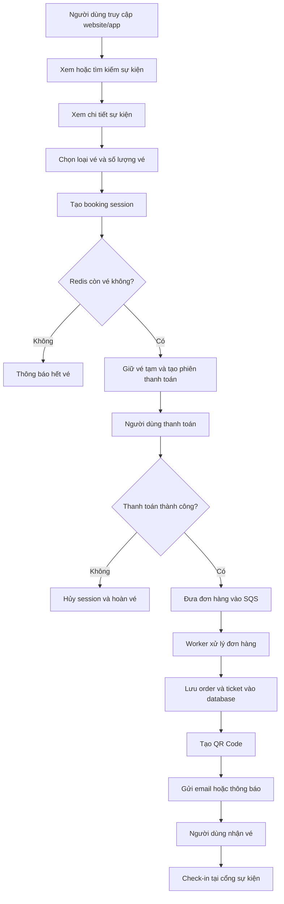
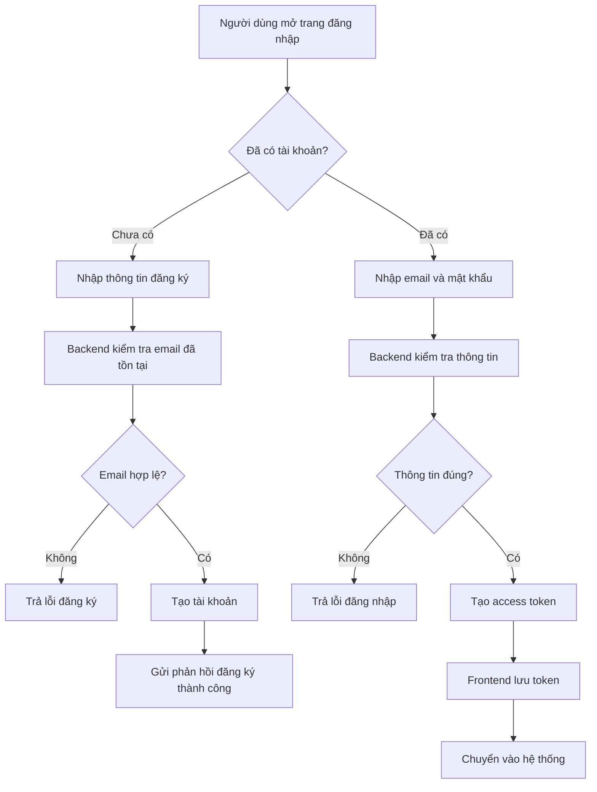
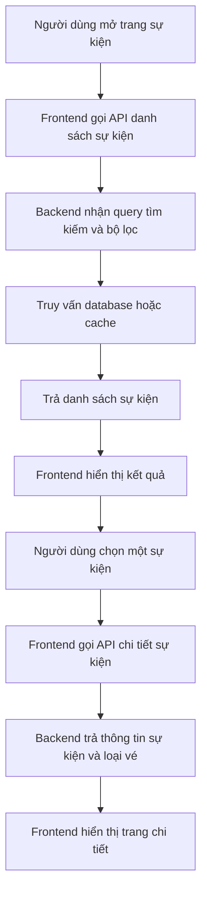
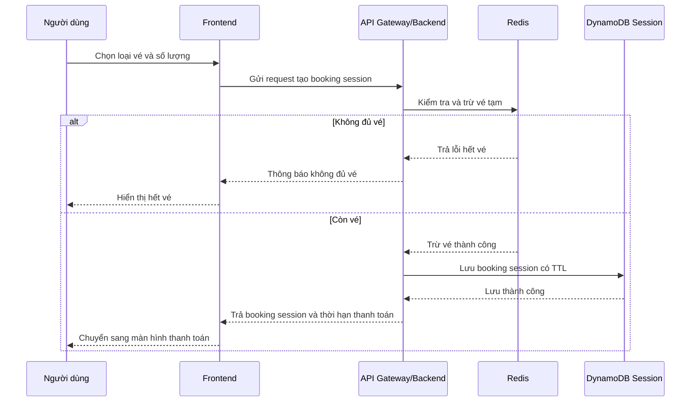
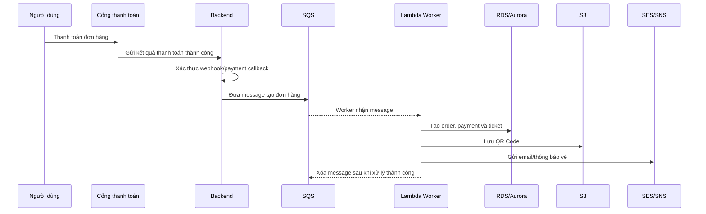
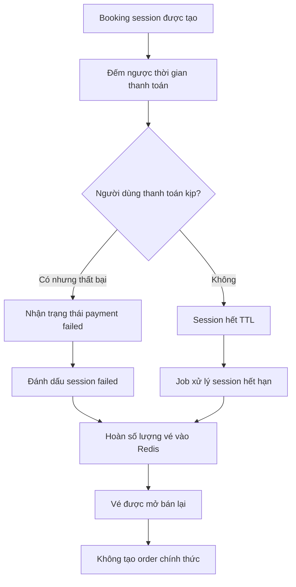
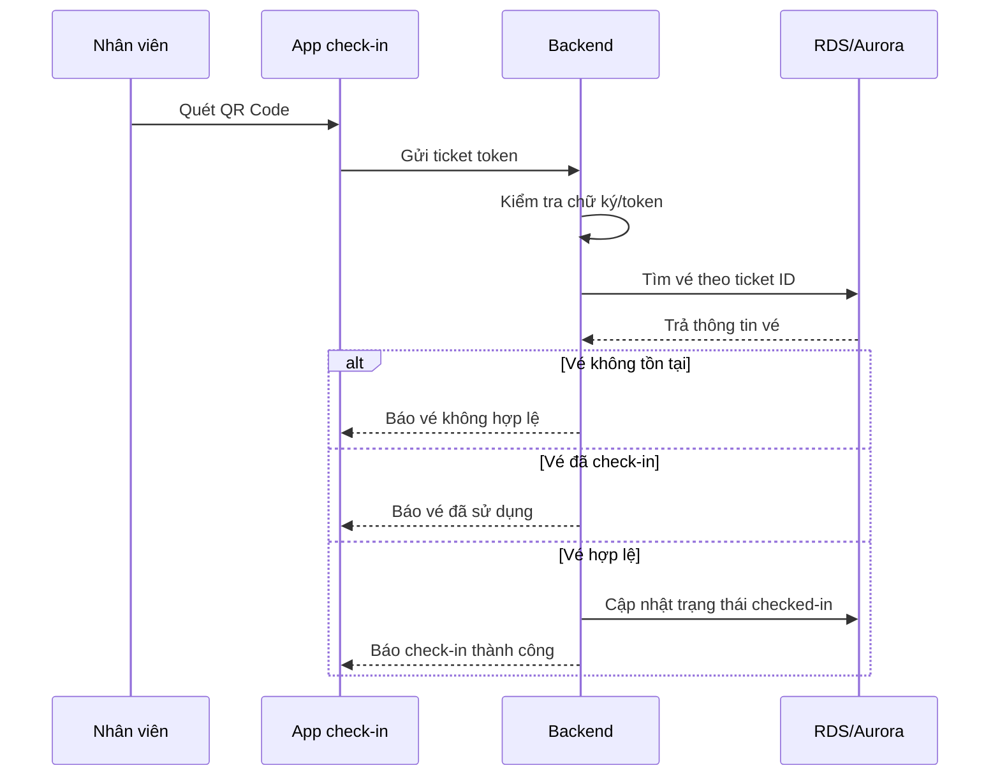
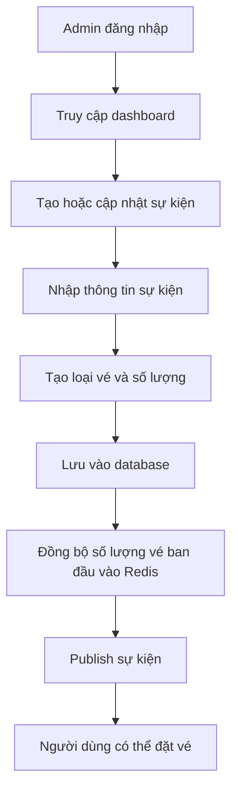
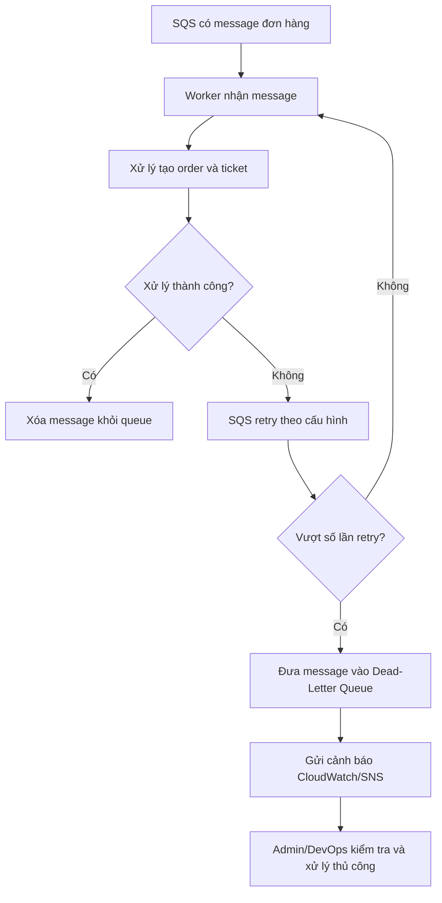

# Flow chương trình

## 1. Flow tổng quan

## 2. Flow đăng ký và đăng nhập

## 3. Flow xem và tìm kiếm sự kiện

## 4. Flow đặt vé

## 5. Flow thanh toán thành công

## 6. Flow thanh toán thất bại hoặc hết hạn

## 7. Flow check-in bằng QR Code

## 8. Flow admin quản lý sự kiện

## 9. Flow xử lý lỗi trong queue

