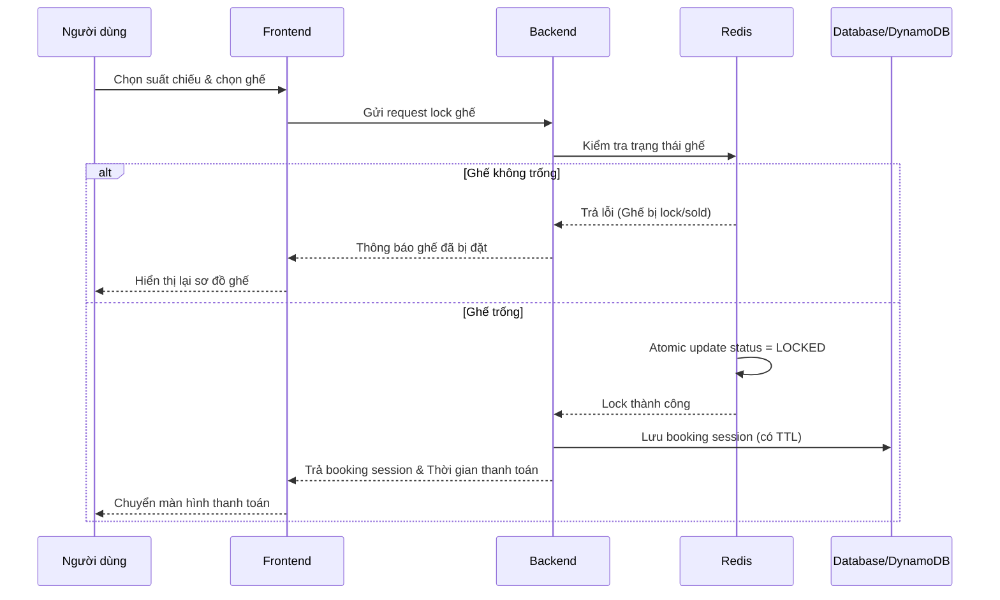
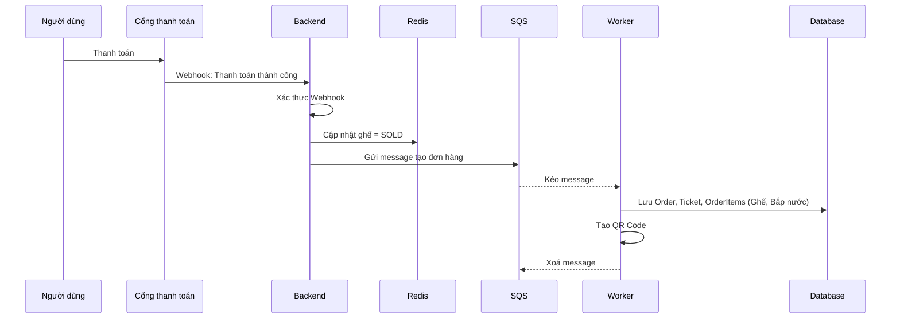
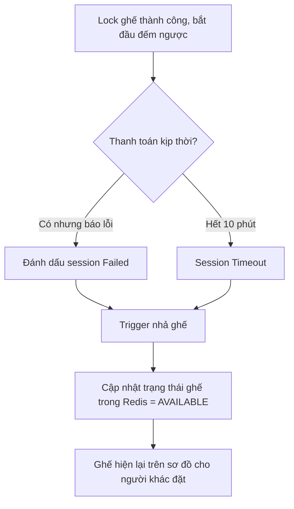
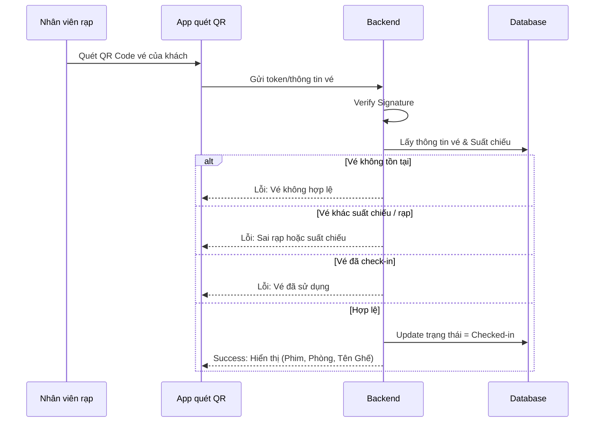

# Flow chương trình

## 1. Flow tổng quan

```mermaid
flowchart TD
    A[Người dùng truy cập website/app] --> B[Xem phim đang chiếu/sắp chiếu]
    B --> C[Xem chi tiết phim, lịch chiếu]
    C --> D[Chọn suất chiếu và rạp]
    D --> E[Chọn ghế ngồi trên sơ đồ]
    E --> F[Tạo booking session (Lock ghế)]
    F --> G{Redis lock ghế thành công?}
    G -- Không --> H[Báo lỗi: Ghế đã có người đặt]
    G -- Có --> I[Tạo phiên thanh toán có Countdown]
    I --> J[Người dùng thanh toán]
    J --> K{Thanh toán thành công?}
    K -- Không --> L[Hết giờ/Lỗi: Nhả ghế về trống]
    K -- Có --> M[Đưa đơn hàng vào SQS]
    M --> N[Worker cập nhật ghế thành Đã Bán]
    N --> O[Lưu order và ticket vào database]
    O --> P[Tạo QR Code vé phim]
    P --> Q[Gửi email vé]
    Q --> R[Người dùng ra rạp, quét QR để check-in]
```

## 2. Flow đặt vé và chọn ghế



## 3. Flow thanh toán và chốt ghế



## 4. Flow thanh toán thất bại / Hết hạn



## 5. Flow check-in tại rạp


